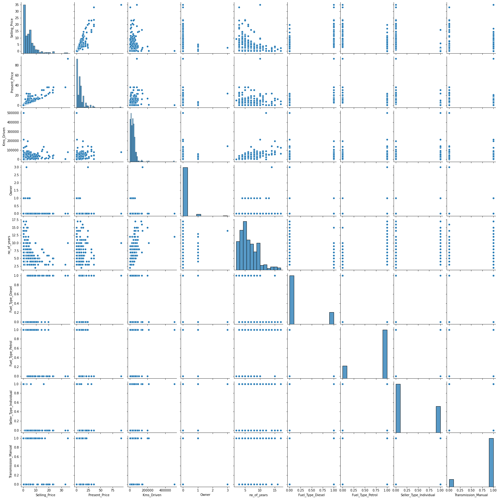
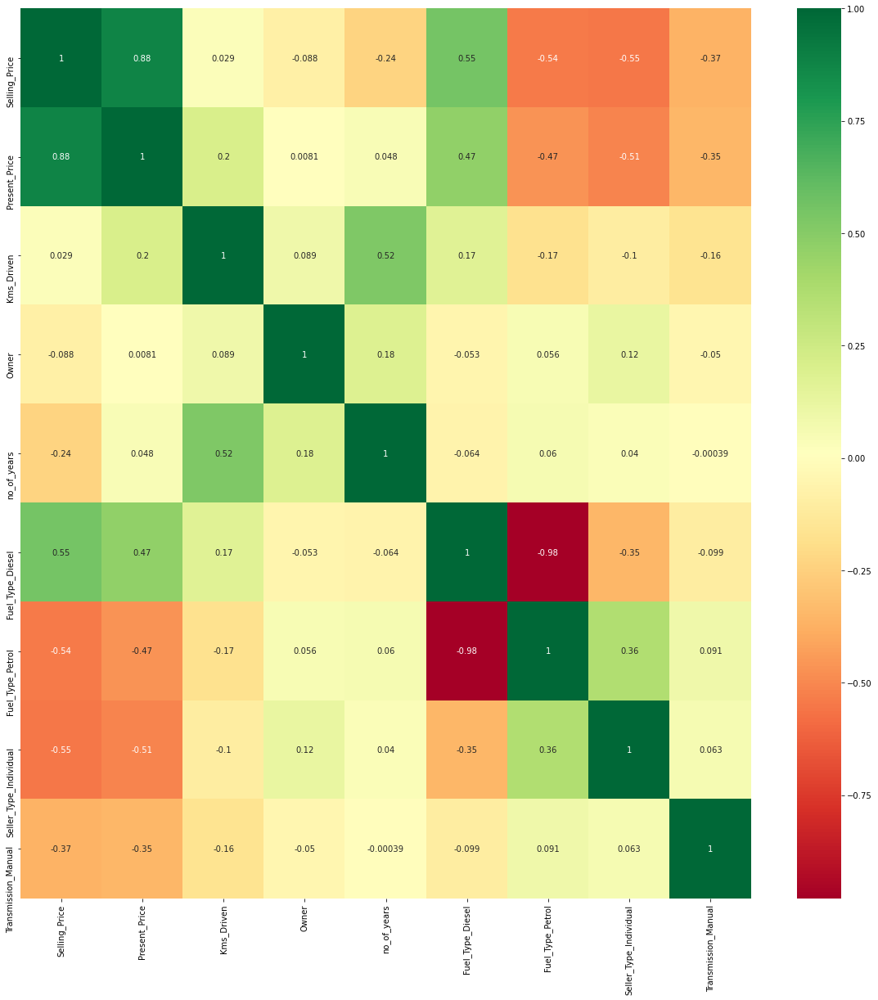
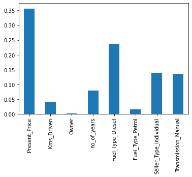
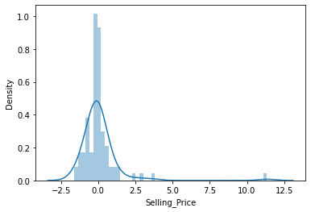
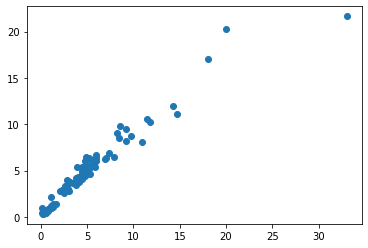

```python
import pandas as pd
df  = pd.read_csv('car data.csv')
df.head()
```


<div>
<style scoped>
    .dataframe tbody tr th:only-of-type {
        vertical-align: middle;
    }

    .dataframe tbody tr th {
        vertical-align: top;
    }

    .dataframe thead th {
        text-align: right;
    }
</style>
<table border="1" class="dataframe">
  <thead>
    <tr style="text-align: right;">
      <th></th>
      <th>Car_Name</th>
      <th>Year</th>
      <th>Selling_Price</th>
      <th>Present_Price</th>
      <th>Kms_Driven</th>
      <th>Fuel_Type</th>
      <th>Seller_Type</th>
      <th>Transmission</th>
      <th>Owner</th>
    </tr>
  </thead>
  <tbody>
    <tr>
      <th>0</th>
      <td>ritz</td>
      <td>2014</td>
      <td>3.35</td>
      <td>5.59</td>
      <td>27000</td>
      <td>Petrol</td>
      <td>Dealer</td>
      <td>Manual</td>
      <td>0</td>
    </tr>
    <tr>
      <th>1</th>
      <td>sx4</td>
      <td>2013</td>
      <td>4.75</td>
      <td>9.54</td>
      <td>43000</td>
      <td>Diesel</td>
      <td>Dealer</td>
      <td>Manual</td>
      <td>0</td>
    </tr>
    <tr>
      <th>2</th>
      <td>ciaz</td>
      <td>2017</td>
      <td>7.25</td>
      <td>9.85</td>
      <td>6900</td>
      <td>Petrol</td>
      <td>Dealer</td>
      <td>Manual</td>
      <td>0</td>
    </tr>
    <tr>
      <th>3</th>
      <td>wagon r</td>
      <td>2011</td>
      <td>2.85</td>
      <td>4.15</td>
      <td>5200</td>
      <td>Petrol</td>
      <td>Dealer</td>
      <td>Manual</td>
      <td>0</td>
    </tr>
    <tr>
      <th>4</th>
      <td>swift</td>
      <td>2014</td>
      <td>4.60</td>
      <td>6.87</td>
      <td>42450</td>
      <td>Diesel</td>
      <td>Dealer</td>
      <td>Manual</td>
      <td>0</td>
    </tr>
  </tbody>
</table>
</div>


```python
#check missing value
df.isnull().sum()
```


    Car_Name         0
    Year             0
    Selling_Price    0
    Present_Price    0
    Kms_Driven       0
    Fuel_Type        0
    Seller_Type      0
    Transmission     0
    Owner            0
    dtype: int64


```python
df.shape
```


    (301, 9)


```python
df.info()
```

    <class 'pandas.core.frame.DataFrame'>
    RangeIndex: 301 entries, 0 to 300
    Data columns (total 9 columns):
     #   Column         Non-Null Count  Dtype  
    ---  ------         --------------  -----  
     0   Car_Name       301 non-null    object 
     1   Year           301 non-null    int64  
     2   Selling_Price  301 non-null    float64
     3   Present_Price  301 non-null    float64
     4   Kms_Driven     301 non-null    int64  
     5   Fuel_Type      301 non-null    object 
     6   Seller_Type    301 non-null    object 
     7   Transmission   301 non-null    object 
     8   Owner          301 non-null    int64  
    dtypes: float64(2), int64(3), object(4)
    memory usage: 21.3+ KB
    


```python
print(df['Seller_Type'].unique())
print(df['Fuel_Type'].unique())
print(df['Transmission'].unique())
print(df['Owner'].unique())
```

    ['Dealer' 'Individual']
    ['Petrol' 'Diesel' 'CNG']
    ['Manual' 'Automatic']
    [0 1 3]
    


```python
df.describe()
```


<div>
<style scoped>
    .dataframe tbody tr th:only-of-type {
        vertical-align: middle;
    }

    .dataframe tbody tr th {
        vertical-align: top;
    }

    .dataframe thead th {
        text-align: right;
    }
</style>
<table border="1" class="dataframe">
  <thead>
    <tr style="text-align: right;">
      <th></th>
      <th>Year</th>
      <th>Selling_Price</th>
      <th>Present_Price</th>
      <th>Kms_Driven</th>
      <th>Owner</th>
    </tr>
  </thead>
  <tbody>
    <tr>
      <th>count</th>
      <td>301.000000</td>
      <td>301.000000</td>
      <td>301.000000</td>
      <td>301.000000</td>
      <td>301.000000</td>
    </tr>
    <tr>
      <th>mean</th>
      <td>2013.627907</td>
      <td>4.661296</td>
      <td>7.628472</td>
      <td>36947.205980</td>
      <td>0.043189</td>
    </tr>
    <tr>
      <th>std</th>
      <td>2.891554</td>
      <td>5.082812</td>
      <td>8.644115</td>
      <td>38886.883882</td>
      <td>0.247915</td>
    </tr>
    <tr>
      <th>min</th>
      <td>2003.000000</td>
      <td>0.100000</td>
      <td>0.320000</td>
      <td>500.000000</td>
      <td>0.000000</td>
    </tr>
    <tr>
      <th>25%</th>
      <td>2012.000000</td>
      <td>0.900000</td>
      <td>1.200000</td>
      <td>15000.000000</td>
      <td>0.000000</td>
    </tr>
    <tr>
      <th>50%</th>
      <td>2014.000000</td>
      <td>3.600000</td>
      <td>6.400000</td>
      <td>32000.000000</td>
      <td>0.000000</td>
    </tr>
    <tr>
      <th>75%</th>
      <td>2016.000000</td>
      <td>6.000000</td>
      <td>9.900000</td>
      <td>48767.000000</td>
      <td>0.000000</td>
    </tr>
    <tr>
      <th>max</th>
      <td>2018.000000</td>
      <td>35.000000</td>
      <td>92.600000</td>
      <td>500000.000000</td>
      <td>3.000000</td>
    </tr>
  </tbody>
</table>
</div>


```python
final_dataset = df[['Year','Selling_Price','Present_Price','Kms_Driven','Fuel_Type','Seller_Type','Transmission','Owner']]
```


```python
final_dataset.head()
```


<div>
<style scoped>
    .dataframe tbody tr th:only-of-type {
        vertical-align: middle;
    }

    .dataframe tbody tr th {
        vertical-align: top;
    }

    .dataframe thead th {
        text-align: right;
    }
</style>
<table border="1" class="dataframe">
  <thead>
    <tr style="text-align: right;">
      <th></th>
      <th>Year</th>
      <th>Selling_Price</th>
      <th>Present_Price</th>
      <th>Kms_Driven</th>
      <th>Fuel_Type</th>
      <th>Seller_Type</th>
      <th>Transmission</th>
      <th>Owner</th>
    </tr>
  </thead>
  <tbody>
    <tr>
      <th>0</th>
      <td>2014</td>
      <td>3.35</td>
      <td>5.59</td>
      <td>27000</td>
      <td>Petrol</td>
      <td>Dealer</td>
      <td>Manual</td>
      <td>0</td>
    </tr>
    <tr>
      <th>1</th>
      <td>2013</td>
      <td>4.75</td>
      <td>9.54</td>
      <td>43000</td>
      <td>Diesel</td>
      <td>Dealer</td>
      <td>Manual</td>
      <td>0</td>
    </tr>
    <tr>
      <th>2</th>
      <td>2017</td>
      <td>7.25</td>
      <td>9.85</td>
      <td>6900</td>
      <td>Petrol</td>
      <td>Dealer</td>
      <td>Manual</td>
      <td>0</td>
    </tr>
    <tr>
      <th>3</th>
      <td>2011</td>
      <td>2.85</td>
      <td>4.15</td>
      <td>5200</td>
      <td>Petrol</td>
      <td>Dealer</td>
      <td>Manual</td>
      <td>0</td>
    </tr>
    <tr>
      <th>4</th>
      <td>2014</td>
      <td>4.60</td>
      <td>6.87</td>
      <td>42450</td>
      <td>Diesel</td>
      <td>Dealer</td>
      <td>Manual</td>
      <td>0</td>
    </tr>
  </tbody>
</table>
</div>


```python
final_dataset['current_year'] = 2020
```


```python
final_dataset.head()
```


<div>
<style scoped>
    .dataframe tbody tr th:only-of-type {
        vertical-align: middle;
    }

    .dataframe tbody tr th {
        vertical-align: top;
    }

    .dataframe thead th {
        text-align: right;
    }
</style>
<table border="1" class="dataframe">
  <thead>
    <tr style="text-align: right;">
      <th></th>
      <th>Year</th>
      <th>Selling_Price</th>
      <th>Present_Price</th>
      <th>Kms_Driven</th>
      <th>Fuel_Type</th>
      <th>Seller_Type</th>
      <th>Transmission</th>
      <th>Owner</th>
      <th>current_year</th>
    </tr>
  </thead>
  <tbody>
    <tr>
      <th>0</th>
      <td>2014</td>
      <td>3.35</td>
      <td>5.59</td>
      <td>27000</td>
      <td>Petrol</td>
      <td>Dealer</td>
      <td>Manual</td>
      <td>0</td>
      <td>2020</td>
    </tr>
    <tr>
      <th>1</th>
      <td>2013</td>
      <td>4.75</td>
      <td>9.54</td>
      <td>43000</td>
      <td>Diesel</td>
      <td>Dealer</td>
      <td>Manual</td>
      <td>0</td>
      <td>2020</td>
    </tr>
    <tr>
      <th>2</th>
      <td>2017</td>
      <td>7.25</td>
      <td>9.85</td>
      <td>6900</td>
      <td>Petrol</td>
      <td>Dealer</td>
      <td>Manual</td>
      <td>0</td>
      <td>2020</td>
    </tr>
    <tr>
      <th>3</th>
      <td>2011</td>
      <td>2.85</td>
      <td>4.15</td>
      <td>5200</td>
      <td>Petrol</td>
      <td>Dealer</td>
      <td>Manual</td>
      <td>0</td>
      <td>2020</td>
    </tr>
    <tr>
      <th>4</th>
      <td>2014</td>
      <td>4.60</td>
      <td>6.87</td>
      <td>42450</td>
      <td>Diesel</td>
      <td>Dealer</td>
      <td>Manual</td>
      <td>0</td>
      <td>2020</td>
    </tr>
  </tbody>
</table>
</div>


```python
final_dataset['no_of_years'] = final_dataset['current_year'] - final_dataset['Year']
```


```python
final_dataset.head()
```


<div>
<style scoped>
    .dataframe tbody tr th:only-of-type {
        vertical-align: middle;
    }

    .dataframe tbody tr th {
        vertical-align: top;
    }

    .dataframe thead th {
        text-align: right;
    }
</style>
<table border="1" class="dataframe">
  <thead>
    <tr style="text-align: right;">
      <th></th>
      <th>Year</th>
      <th>Selling_Price</th>
      <th>Present_Price</th>
      <th>Kms_Driven</th>
      <th>Fuel_Type</th>
      <th>Seller_Type</th>
      <th>Transmission</th>
      <th>Owner</th>
      <th>current_year</th>
      <th>no_of_years</th>
    </tr>
  </thead>
  <tbody>
    <tr>
      <th>0</th>
      <td>2014</td>
      <td>3.35</td>
      <td>5.59</td>
      <td>27000</td>
      <td>Petrol</td>
      <td>Dealer</td>
      <td>Manual</td>
      <td>0</td>
      <td>2020</td>
      <td>6</td>
    </tr>
    <tr>
      <th>1</th>
      <td>2013</td>
      <td>4.75</td>
      <td>9.54</td>
      <td>43000</td>
      <td>Diesel</td>
      <td>Dealer</td>
      <td>Manual</td>
      <td>0</td>
      <td>2020</td>
      <td>7</td>
    </tr>
    <tr>
      <th>2</th>
      <td>2017</td>
      <td>7.25</td>
      <td>9.85</td>
      <td>6900</td>
      <td>Petrol</td>
      <td>Dealer</td>
      <td>Manual</td>
      <td>0</td>
      <td>2020</td>
      <td>3</td>
    </tr>
    <tr>
      <th>3</th>
      <td>2011</td>
      <td>2.85</td>
      <td>4.15</td>
      <td>5200</td>
      <td>Petrol</td>
      <td>Dealer</td>
      <td>Manual</td>
      <td>0</td>
      <td>2020</td>
      <td>9</td>
    </tr>
    <tr>
      <th>4</th>
      <td>2014</td>
      <td>4.60</td>
      <td>6.87</td>
      <td>42450</td>
      <td>Diesel</td>
      <td>Dealer</td>
      <td>Manual</td>
      <td>0</td>
      <td>2020</td>
      <td>6</td>
    </tr>
  </tbody>
</table>
</div>


```python
final_dataset.drop(['Year','current_year'],axis=1,inplace=True)
```


```python
final_dataset.head()
```


<div>
<style scoped>
    .dataframe tbody tr th:only-of-type {
        vertical-align: middle;
    }

    .dataframe tbody tr th {
        vertical-align: top;
    }

    .dataframe thead th {
        text-align: right;
    }
</style>
<table border="1" class="dataframe">
  <thead>
    <tr style="text-align: right;">
      <th></th>
      <th>Selling_Price</th>
      <th>Present_Price</th>
      <th>Kms_Driven</th>
      <th>Fuel_Type</th>
      <th>Seller_Type</th>
      <th>Transmission</th>
      <th>Owner</th>
      <th>no_of_years</th>
    </tr>
  </thead>
  <tbody>
    <tr>
      <th>0</th>
      <td>3.35</td>
      <td>5.59</td>
      <td>27000</td>
      <td>Petrol</td>
      <td>Dealer</td>
      <td>Manual</td>
      <td>0</td>
      <td>6</td>
    </tr>
    <tr>
      <th>1</th>
      <td>4.75</td>
      <td>9.54</td>
      <td>43000</td>
      <td>Diesel</td>
      <td>Dealer</td>
      <td>Manual</td>
      <td>0</td>
      <td>7</td>
    </tr>
    <tr>
      <th>2</th>
      <td>7.25</td>
      <td>9.85</td>
      <td>6900</td>
      <td>Petrol</td>
      <td>Dealer</td>
      <td>Manual</td>
      <td>0</td>
      <td>3</td>
    </tr>
    <tr>
      <th>3</th>
      <td>2.85</td>
      <td>4.15</td>
      <td>5200</td>
      <td>Petrol</td>
      <td>Dealer</td>
      <td>Manual</td>
      <td>0</td>
      <td>9</td>
    </tr>
    <tr>
      <th>4</th>
      <td>4.60</td>
      <td>6.87</td>
      <td>42450</td>
      <td>Diesel</td>
      <td>Dealer</td>
      <td>Manual</td>
      <td>0</td>
      <td>6</td>
    </tr>
  </tbody>
</table>
</div>


```python
final_dataset = pd.get_dummies(final_dataset,drop_first=True)
```


```python
final_dataset
```


<div>
<style scoped>
    .dataframe tbody tr th:only-of-type {
        vertical-align: middle;
    }

    .dataframe tbody tr th {
        vertical-align: top;
    }

    .dataframe thead th {
        text-align: right;
    }
</style>
<table border="1" class="dataframe">
  <thead>
    <tr style="text-align: right;">
      <th></th>
      <th>Selling_Price</th>
      <th>Present_Price</th>
      <th>Kms_Driven</th>
      <th>Owner</th>
      <th>no_of_years</th>
      <th>Fuel_Type_Diesel</th>
      <th>Fuel_Type_Petrol</th>
      <th>Seller_Type_Individual</th>
      <th>Transmission_Manual</th>
    </tr>
  </thead>
  <tbody>
    <tr>
      <th>0</th>
      <td>3.35</td>
      <td>5.59</td>
      <td>27000</td>
      <td>0</td>
      <td>6</td>
      <td>0</td>
      <td>1</td>
      <td>0</td>
      <td>1</td>
    </tr>
    <tr>
      <th>1</th>
      <td>4.75</td>
      <td>9.54</td>
      <td>43000</td>
      <td>0</td>
      <td>7</td>
      <td>1</td>
      <td>0</td>
      <td>0</td>
      <td>1</td>
    </tr>
    <tr>
      <th>2</th>
      <td>7.25</td>
      <td>9.85</td>
      <td>6900</td>
      <td>0</td>
      <td>3</td>
      <td>0</td>
      <td>1</td>
      <td>0</td>
      <td>1</td>
    </tr>
    <tr>
      <th>3</th>
      <td>2.85</td>
      <td>4.15</td>
      <td>5200</td>
      <td>0</td>
      <td>9</td>
      <td>0</td>
      <td>1</td>
      <td>0</td>
      <td>1</td>
    </tr>
    <tr>
      <th>4</th>
      <td>4.60</td>
      <td>6.87</td>
      <td>42450</td>
      <td>0</td>
      <td>6</td>
      <td>1</td>
      <td>0</td>
      <td>0</td>
      <td>1</td>
    </tr>
    <tr>
      <th>...</th>
      <td>...</td>
      <td>...</td>
      <td>...</td>
      <td>...</td>
      <td>...</td>
      <td>...</td>
      <td>...</td>
      <td>...</td>
      <td>...</td>
    </tr>
    <tr>
      <th>296</th>
      <td>9.50</td>
      <td>11.60</td>
      <td>33988</td>
      <td>0</td>
      <td>4</td>
      <td>1</td>
      <td>0</td>
      <td>0</td>
      <td>1</td>
    </tr>
    <tr>
      <th>297</th>
      <td>4.00</td>
      <td>5.90</td>
      <td>60000</td>
      <td>0</td>
      <td>5</td>
      <td>0</td>
      <td>1</td>
      <td>0</td>
      <td>1</td>
    </tr>
    <tr>
      <th>298</th>
      <td>3.35</td>
      <td>11.00</td>
      <td>87934</td>
      <td>0</td>
      <td>11</td>
      <td>0</td>
      <td>1</td>
      <td>0</td>
      <td>1</td>
    </tr>
    <tr>
      <th>299</th>
      <td>11.50</td>
      <td>12.50</td>
      <td>9000</td>
      <td>0</td>
      <td>3</td>
      <td>1</td>
      <td>0</td>
      <td>0</td>
      <td>1</td>
    </tr>
    <tr>
      <th>300</th>
      <td>5.30</td>
      <td>5.90</td>
      <td>5464</td>
      <td>0</td>
      <td>4</td>
      <td>0</td>
      <td>1</td>
      <td>0</td>
      <td>1</td>
    </tr>
  </tbody>
</table>
<p>301 rows × 9 columns</p>
</div>


```python
import seaborn as sns
```


```python
sns.pairplot(final_dataset)
```


    <seaborn.axisgrid.PairGrid at 0x21e9a05e1c8>


    

    


```python
import matplotlib.pyplot as plt
%matplotlib inline
```


```python
cormat = final_dataset.corr()
top_corr_features = cormat.index
plt.figure(figsize=(20,20))
#plot heatmap
g = sns.heatmap(final_dataset[top_corr_features].corr(),annot=True,cmap="RdYlGn")
```


    

    


```python
final_dataset.head()
```


<div>
<style scoped>
    .dataframe tbody tr th:only-of-type {
        vertical-align: middle;
    }

    .dataframe tbody tr th {
        vertical-align: top;
    }

    .dataframe thead th {
        text-align: right;
    }
</style>
<table border="1" class="dataframe">
  <thead>
    <tr style="text-align: right;">
      <th></th>
      <th>Selling_Price</th>
      <th>Present_Price</th>
      <th>Kms_Driven</th>
      <th>Owner</th>
      <th>no_of_years</th>
      <th>Fuel_Type_Diesel</th>
      <th>Fuel_Type_Petrol</th>
      <th>Seller_Type_Individual</th>
      <th>Transmission_Manual</th>
    </tr>
  </thead>
  <tbody>
    <tr>
      <th>0</th>
      <td>3.35</td>
      <td>5.59</td>
      <td>27000</td>
      <td>0</td>
      <td>6</td>
      <td>0</td>
      <td>1</td>
      <td>0</td>
      <td>1</td>
    </tr>
    <tr>
      <th>1</th>
      <td>4.75</td>
      <td>9.54</td>
      <td>43000</td>
      <td>0</td>
      <td>7</td>
      <td>1</td>
      <td>0</td>
      <td>0</td>
      <td>1</td>
    </tr>
    <tr>
      <th>2</th>
      <td>7.25</td>
      <td>9.85</td>
      <td>6900</td>
      <td>0</td>
      <td>3</td>
      <td>0</td>
      <td>1</td>
      <td>0</td>
      <td>1</td>
    </tr>
    <tr>
      <th>3</th>
      <td>2.85</td>
      <td>4.15</td>
      <td>5200</td>
      <td>0</td>
      <td>9</td>
      <td>0</td>
      <td>1</td>
      <td>0</td>
      <td>1</td>
    </tr>
    <tr>
      <th>4</th>
      <td>4.60</td>
      <td>6.87</td>
      <td>42450</td>
      <td>0</td>
      <td>6</td>
      <td>1</td>
      <td>0</td>
      <td>0</td>
      <td>1</td>
    </tr>
  </tbody>
</table>
</div>


```python
X = final_dataset.iloc[:,1:]
```


```python
y = final_dataset.iloc[:,0]
```


```python
from sklearn.model_selection import train_test_split
from sklearn.ensemble import ExtraTreesRegressor
model = ExtraTreesRegressor()
model.fit(X,y)
```


    ExtraTreesRegressor()


```python
print(model.feature_importances_)
```

    [3.56687179e-01 3.97945638e-02 3.21514700e-04 7.92026611e-02
     2.36006287e-01 1.53900868e-02 1.39199085e-01 1.33398623e-01]
    


```python
#plot the graph for better feature importance
feat_importance = pd.Series(model.feature_importances_,index= X.columns)
feat_importance.plot(kind='bar')
```


    <AxesSubplot:>


    

    


```python
X_train,X_test,y_train,y_test = train_test_split(X,y,test_size=0.3,random_state=10)
```


```python
X_train.shape
```


    (210, 8)


```python
from sklearn.ensemble import RandomForestRegressor
rf_random = RandomForestRegressor()
```


```python
###Hyper para metetrs
import numpy as np
n_estimators = [int(x) for x in np.linspace(start = 100,stop = 1200,num=12)]
print(n_estimators)
```

    [100, 200, 300, 400, 500, 600, 700, 800, 900, 1000, 1100, 1200]
    


```python
#Randomized Search CV

# Number of trees in random forest
n_estimators = [int(x) for x in np.linspace(start = 100, stop = 1200, num = 12)]
# Number of features to consider at every split
max_features = ['auto', 'sqrt']
# Maximum number of levels in tree
max_depth = [int(x) for x in np.linspace(5, 30, num = 6)]
# max_depth.append(None)
# Minimum number of samples required to split a node
min_samples_split = [2, 5, 10, 15, 100]
# Minimum number of samples required at each leaf node
min_samples_leaf = [1, 2, 5, 10]
```


```python
from sklearn.model_selection import RandomizedSearchCV
```


```python
# Create the random grid
random_grid = {'n_estimators': n_estimators,
               'max_features': max_features,
               'max_depth': max_depth,
               'min_samples_split': min_samples_split,
               'min_samples_leaf': min_samples_leaf}

print(random_grid)
```

    {'n_estimators': [100, 200, 300, 400, 500, 600, 700, 800, 900, 1000, 1100, 1200], 'max_features': ['auto', 'sqrt'], 'max_depth': [5, 10, 15, 20, 25, 30], 'min_samples_split': [2, 5, 10, 15, 100], 'min_samples_leaf': [1, 2, 5, 10]}
    


```python
# Use the random grid to search for best hyperparameters
# First create the base model to tune
rf = RandomForestRegressor()
```


```python
# Random search of parameters, using 3 fold cross validation, 
# search across 100 different combinations
rf_random = RandomizedSearchCV(estimator = rf, param_distributions = random_grid,scoring='neg_mean_squared_error', n_iter = 10, cv = 5, verbose=2, random_state=42, n_jobs = 1)
```


```python
rf_random.fit(X_train,y_train)
```

    Fitting 5 folds for each of 10 candidates, totalling 50 fits
    [CV] n_estimators=900, min_samples_split=5, min_samples_leaf=5, max_features=sqrt, max_depth=10 
    

    [Parallel(n_jobs=1)]: Using backend SequentialBackend with 1 concurrent workers.
    

    [CV]  n_estimators=900, min_samples_split=5, min_samples_leaf=5, max_features=sqrt, max_depth=10, total=   1.8s
    [CV] n_estimators=900, min_samples_split=5, min_samples_leaf=5, max_features=sqrt, max_depth=10 
    

    [Parallel(n_jobs=1)]: Done   1 out of   1 | elapsed:    1.7s remaining:    0.0s
    

    [CV]  n_estimators=900, min_samples_split=5, min_samples_leaf=5, max_features=sqrt, max_depth=10, total=   1.6s
    [CV] n_estimators=900, min_samples_split=5, min_samples_leaf=5, max_features=sqrt, max_depth=10 
    [CV]  n_estimators=900, min_samples_split=5, min_samples_leaf=5, max_features=sqrt, max_depth=10, total=   1.6s
    [CV] n_estimators=900, min_samples_split=5, min_samples_leaf=5, max_features=sqrt, max_depth=10 
    [CV]  n_estimators=900, min_samples_split=5, min_samples_leaf=5, max_features=sqrt, max_depth=10, total=   1.7s
    [CV] n_estimators=900, min_samples_split=5, min_samples_leaf=5, max_features=sqrt, max_depth=10 
    [CV]  n_estimators=900, min_samples_split=5, min_samples_leaf=5, max_features=sqrt, max_depth=10, total=   1.8s
    [CV] n_estimators=1100, min_samples_split=10, min_samples_leaf=2, max_features=sqrt, max_depth=15 
    [CV]  n_estimators=1100, min_samples_split=10, min_samples_leaf=2, max_features=sqrt, max_depth=15, total=   2.4s
    [CV] n_estimators=1100, min_samples_split=10, min_samples_leaf=2, max_features=sqrt, max_depth=15 
    [CV]  n_estimators=1100, min_samples_split=10, min_samples_leaf=2, max_features=sqrt, max_depth=15, total=   2.0s
    [CV] n_estimators=1100, min_samples_split=10, min_samples_leaf=2, max_features=sqrt, max_depth=15 
    [CV]  n_estimators=1100, min_samples_split=10, min_samples_leaf=2, max_features=sqrt, max_depth=15, total=   2.1s
    [CV] n_estimators=1100, min_samples_split=10, min_samples_leaf=2, max_features=sqrt, max_depth=15 
    [CV]  n_estimators=1100, min_samples_split=10, min_samples_leaf=2, max_features=sqrt, max_depth=15, total=   2.3s
    [CV] n_estimators=1100, min_samples_split=10, min_samples_leaf=2, max_features=sqrt, max_depth=15 
    [CV]  n_estimators=1100, min_samples_split=10, min_samples_leaf=2, max_features=sqrt, max_depth=15, total=   2.0s
    [CV] n_estimators=300, min_samples_split=100, min_samples_leaf=5, max_features=auto, max_depth=15 
    [CV]  n_estimators=300, min_samples_split=100, min_samples_leaf=5, max_features=auto, max_depth=15, total=   0.5s
    [CV] n_estimators=300, min_samples_split=100, min_samples_leaf=5, max_features=auto, max_depth=15 
    [CV]  n_estimators=300, min_samples_split=100, min_samples_leaf=5, max_features=auto, max_depth=15, total=   0.5s
    [CV] n_estimators=300, min_samples_split=100, min_samples_leaf=5, max_features=auto, max_depth=15 
    [CV]  n_estimators=300, min_samples_split=100, min_samples_leaf=5, max_features=auto, max_depth=15, total=   0.5s
    [CV] n_estimators=300, min_samples_split=100, min_samples_leaf=5, max_features=auto, max_depth=15 
    [CV]  n_estimators=300, min_samples_split=100, min_samples_leaf=5, max_features=auto, max_depth=15, total=   0.5s
    [CV] n_estimators=300, min_samples_split=100, min_samples_leaf=5, max_features=auto, max_depth=15 
    [CV]  n_estimators=300, min_samples_split=100, min_samples_leaf=5, max_features=auto, max_depth=15, total=   0.6s
    [CV] n_estimators=400, min_samples_split=5, min_samples_leaf=5, max_features=auto, max_depth=15 
    [CV]  n_estimators=400, min_samples_split=5, min_samples_leaf=5, max_features=auto, max_depth=15, total=   0.8s
    [CV] n_estimators=400, min_samples_split=5, min_samples_leaf=5, max_features=auto, max_depth=15 
    [CV]  n_estimators=400, min_samples_split=5, min_samples_leaf=5, max_features=auto, max_depth=15, total=   0.8s
    [CV] n_estimators=400, min_samples_split=5, min_samples_leaf=5, max_features=auto, max_depth=15 
    [CV]  n_estimators=400, min_samples_split=5, min_samples_leaf=5, max_features=auto, max_depth=15, total=   0.8s
    [CV] n_estimators=400, min_samples_split=5, min_samples_leaf=5, max_features=auto, max_depth=15 
    [CV]  n_estimators=400, min_samples_split=5, min_samples_leaf=5, max_features=auto, max_depth=15, total=   0.9s
    [CV] n_estimators=400, min_samples_split=5, min_samples_leaf=5, max_features=auto, max_depth=15 
    [CV]  n_estimators=400, min_samples_split=5, min_samples_leaf=5, max_features=auto, max_depth=15, total=   0.8s
    [CV] n_estimators=700, min_samples_split=5, min_samples_leaf=10, max_features=auto, max_depth=20 
    [CV]  n_estimators=700, min_samples_split=5, min_samples_leaf=10, max_features=auto, max_depth=20, total=   1.3s
    [CV] n_estimators=700, min_samples_split=5, min_samples_leaf=10, max_features=auto, max_depth=20 
    [CV]  n_estimators=700, min_samples_split=5, min_samples_leaf=10, max_features=auto, max_depth=20, total=   1.7s
    [CV] n_estimators=700, min_samples_split=5, min_samples_leaf=10, max_features=auto, max_depth=20 
    [CV]  n_estimators=700, min_samples_split=5, min_samples_leaf=10, max_features=auto, max_depth=20, total=   1.3s
    [CV] n_estimators=700, min_samples_split=5, min_samples_leaf=10, max_features=auto, max_depth=20 
    [CV]  n_estimators=700, min_samples_split=5, min_samples_leaf=10, max_features=auto, max_depth=20, total=   1.4s
    [CV] n_estimators=700, min_samples_split=5, min_samples_leaf=10, max_features=auto, max_depth=20 
    [CV]  n_estimators=700, min_samples_split=5, min_samples_leaf=10, max_features=auto, max_depth=20, total=   1.6s
    [CV] n_estimators=1000, min_samples_split=2, min_samples_leaf=1, max_features=sqrt, max_depth=25 
    [CV]  n_estimators=1000, min_samples_split=2, min_samples_leaf=1, max_features=sqrt, max_depth=25, total=   2.1s
    [CV] n_estimators=1000, min_samples_split=2, min_samples_leaf=1, max_features=sqrt, max_depth=25 
    [CV]  n_estimators=1000, min_samples_split=2, min_samples_leaf=1, max_features=sqrt, max_depth=25, total=   2.1s
    [CV] n_estimators=1000, min_samples_split=2, min_samples_leaf=1, max_features=sqrt, max_depth=25 
    [CV]  n_estimators=1000, min_samples_split=2, min_samples_leaf=1, max_features=sqrt, max_depth=25, total=   1.9s
    [CV] n_estimators=1000, min_samples_split=2, min_samples_leaf=1, max_features=sqrt, max_depth=25 
    [CV]  n_estimators=1000, min_samples_split=2, min_samples_leaf=1, max_features=sqrt, max_depth=25, total=   2.3s
    [CV] n_estimators=1000, min_samples_split=2, min_samples_leaf=1, max_features=sqrt, max_depth=25 
    [CV]  n_estimators=1000, min_samples_split=2, min_samples_leaf=1, max_features=sqrt, max_depth=25, total=   2.2s
    [CV] n_estimators=1100, min_samples_split=15, min_samples_leaf=10, max_features=sqrt, max_depth=5 
    [CV]  n_estimators=1100, min_samples_split=15, min_samples_leaf=10, max_features=sqrt, max_depth=5, total=   2.0s
    [CV] n_estimators=1100, min_samples_split=15, min_samples_leaf=10, max_features=sqrt, max_depth=5 
    [CV]  n_estimators=1100, min_samples_split=15, min_samples_leaf=10, max_features=sqrt, max_depth=5, total=   2.0s
    [CV] n_estimators=1100, min_samples_split=15, min_samples_leaf=10, max_features=sqrt, max_depth=5 
    [CV]  n_estimators=1100, min_samples_split=15, min_samples_leaf=10, max_features=sqrt, max_depth=5, total=   2.3s
    [CV] n_estimators=1100, min_samples_split=15, min_samples_leaf=10, max_features=sqrt, max_depth=5 
    [CV]  n_estimators=1100, min_samples_split=15, min_samples_leaf=10, max_features=sqrt, max_depth=5, total=   2.1s
    [CV] n_estimators=1100, min_samples_split=15, min_samples_leaf=10, max_features=sqrt, max_depth=5 
    [CV]  n_estimators=1100, min_samples_split=15, min_samples_leaf=10, max_features=sqrt, max_depth=5, total=   2.4s
    [CV] n_estimators=300, min_samples_split=15, min_samples_leaf=1, max_features=sqrt, max_depth=15 
    [CV]  n_estimators=300, min_samples_split=15, min_samples_leaf=1, max_features=sqrt, max_depth=15, total=   0.6s
    [CV] n_estimators=300, min_samples_split=15, min_samples_leaf=1, max_features=sqrt, max_depth=15 
    [CV]  n_estimators=300, min_samples_split=15, min_samples_leaf=1, max_features=sqrt, max_depth=15, total=   0.6s
    [CV] n_estimators=300, min_samples_split=15, min_samples_leaf=1, max_features=sqrt, max_depth=15 
    [CV]  n_estimators=300, min_samples_split=15, min_samples_leaf=1, max_features=sqrt, max_depth=15, total=   0.7s
    [CV] n_estimators=300, min_samples_split=15, min_samples_leaf=1, max_features=sqrt, max_depth=15 
    [CV]  n_estimators=300, min_samples_split=15, min_samples_leaf=1, max_features=sqrt, max_depth=15, total=   0.7s
    [CV] n_estimators=300, min_samples_split=15, min_samples_leaf=1, max_features=sqrt, max_depth=15 
    [CV]  n_estimators=300, min_samples_split=15, min_samples_leaf=1, max_features=sqrt, max_depth=15, total=   0.6s
    [CV] n_estimators=700, min_samples_split=10, min_samples_leaf=2, max_features=sqrt, max_depth=5 
    [CV]  n_estimators=700, min_samples_split=10, min_samples_leaf=2, max_features=sqrt, max_depth=5, total=   1.3s
    [CV] n_estimators=700, min_samples_split=10, min_samples_leaf=2, max_features=sqrt, max_depth=5 
    [CV]  n_estimators=700, min_samples_split=10, min_samples_leaf=2, max_features=sqrt, max_depth=5, total=   1.4s
    [CV] n_estimators=700, min_samples_split=10, min_samples_leaf=2, max_features=sqrt, max_depth=5 
    [CV]  n_estimators=700, min_samples_split=10, min_samples_leaf=2, max_features=sqrt, max_depth=5, total=   1.4s
    [CV] n_estimators=700, min_samples_split=10, min_samples_leaf=2, max_features=sqrt, max_depth=5 
    [CV]  n_estimators=700, min_samples_split=10, min_samples_leaf=2, max_features=sqrt, max_depth=5, total=   1.3s
    [CV] n_estimators=700, min_samples_split=10, min_samples_leaf=2, max_features=sqrt, max_depth=5 
    [CV]  n_estimators=700, min_samples_split=10, min_samples_leaf=2, max_features=sqrt, max_depth=5, total=   1.4s
    [CV] n_estimators=700, min_samples_split=15, min_samples_leaf=1, max_features=auto, max_depth=20 
    [CV]  n_estimators=700, min_samples_split=15, min_samples_leaf=1, max_features=auto, max_depth=20, total=   1.4s
    [CV] n_estimators=700, min_samples_split=15, min_samples_leaf=1, max_features=auto, max_depth=20 
    [CV]  n_estimators=700, min_samples_split=15, min_samples_leaf=1, max_features=auto, max_depth=20, total=   1.3s
    [CV] n_estimators=700, min_samples_split=15, min_samples_leaf=1, max_features=auto, max_depth=20 
    [CV]  n_estimators=700, min_samples_split=15, min_samples_leaf=1, max_features=auto, max_depth=20, total=   1.5s
    [CV] n_estimators=700, min_samples_split=15, min_samples_leaf=1, max_features=auto, max_depth=20 
    [CV]  n_estimators=700, min_samples_split=15, min_samples_leaf=1, max_features=auto, max_depth=20, total=   1.5s
    [CV] n_estimators=700, min_samples_split=15, min_samples_leaf=1, max_features=auto, max_depth=20 
    [CV]  n_estimators=700, min_samples_split=15, min_samples_leaf=1, max_features=auto, max_depth=20, total=   1.4s
    

    [Parallel(n_jobs=1)]: Done  50 out of  50 | elapsed:  1.2min finished
    


    RandomizedSearchCV(cv=5, estimator=RandomForestRegressor(), n_jobs=1,
                       param_distributions={'max_depth': [5, 10, 15, 20, 25, 30],
                                            'max_features': ['auto', 'sqrt'],
                                            'min_samples_leaf': [1, 2, 5, 10],
                                            'min_samples_split': [2, 5, 10, 15,
                                                                  100],
                                            'n_estimators': [100, 200, 300, 400,
                                                             500, 600, 700, 800,
                                                             900, 1000, 1100,
                                                             1200]},
                       random_state=42, scoring='neg_mean_squared_error',
                       verbose=2)


```python
rf_random.best_params_
```


    {'n_estimators': 1000,
     'min_samples_split': 2,
     'min_samples_leaf': 1,
     'max_features': 'sqrt',
     'max_depth': 25}


```python

rf_random.best_score_
```


    -5.092124406076687


```python
predictions=rf_random.predict(X_test)
```


```python

sns.distplot(y_test-predictions)
```

    C:\Users\pramodh\Anaconda3\lib\site-packages\seaborn\distributions.py:2551: FutureWarning: `distplot` is a deprecated function and will be removed in a future version. Please adapt your code to use either `displot` (a figure-level function with similar flexibility) or `histplot` (an axes-level function for histograms).
      warnings.warn(msg, FutureWarning)
    


    <AxesSubplot:xlabel='Selling_Price', ylabel='Density'>


    

    


```python
plt.scatter(y_test,predictions)
```


    <matplotlib.collections.PathCollection at 0x21ea0973888>


    

    


```python
from sklearn import metrics
```


```python
print('MAE:', metrics.mean_absolute_error(y_test, predictions))
print('MSE:', metrics.mean_squared_error(y_test, predictions))
print('RMSE:', np.sqrt(metrics.mean_squared_error(y_test, predictions)))

```

    MAE: 0.6328971428571408
    MSE: 2.053957719575826
    RMSE: 1.4331635355310384
    


```python
import pickle
# open a file, where you ant to store the data
file = open('random_forest_regression_model.pkl', 'wb')

# dump information to that file
pickle.dump(rf_random, file)

```


```python

```


```python

```
